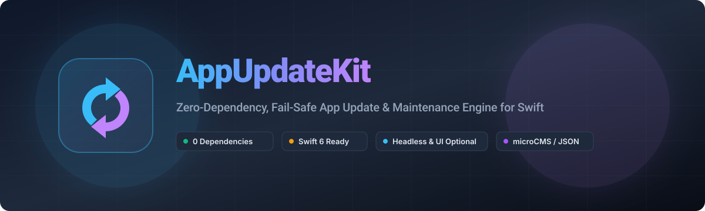

<p align="center">
  
</p>

<p align="center">
  <a href="https://github.com/iletai/AppUpdateKit/actions"></a>
  
  
  
  <a href="LICENSE"></a>
</p>

<p align="center">
  🌐 <b>Language Selection / Chọn ngôn ngữ / 言語選択:</b><br/>
  <a href="README.md">🇬🇧 English</a> &nbsp;|&nbsp;
  <a href="README.vi.md">🇻🇳 Tiếng Việt</a> &nbsp;|&nbsp;
  <b>🇯🇵 日本語</b>
</p>

---

# AppUpdateKit

**AppUpdateKit** は、完全な **Headless-First** 設計を採用した超軽量・依存関係ゼロ（Zero Dependency）の Swift Package です。**microCMS** や **Raw JSON (GitHub Raw, S3, Cloudflare Workers)** などを介して、アプリの強制アップデート（Force Update）、任意アップデート（Optional Update・更新履歴付き）、およびメンテナンスモード（Maintenance Mode）をリモートで制御します。

### 🌟 主な特徴 & 設計思想
- **完全な Headless 設計（UI の強制なし）:** 純粋なビジネスロジックエンジン (`AppUpdateChecker`, `AppUpdateEvaluator`, `AppVersion`, `AppUpdateConfig`) を提供します。標準 UI の使用は強制されません。生のモデル、メタデータ、バージョンオブジェクト、イベントストリームがすべて公開されているため、独自のカスタム UI、モーダル、または React Native / Flutter ブリッジを自由に構築できます。
- **外部依存性ゼロ:** Apple 標準フレームワーク (`Foundation`, `SwiftUI`, `Combine`, `UIKit`) のみで動作。
- **O(N) SemVer 比較エンジン:** バージョン文字列の正規化 (`"1.2"` == `"1.2.0"` == `"1.2.0.0"`, `"1.10.0"` > `"1.2.0"`) およびプレリリースタグ・ビルドメタデータの自動除去に対応。
- **フェイルセーフ設計:** ネットワークエラー、タイムアウト、または不正な JSON が発生した場合でも、クラッシュせずに `.none` へ安全にフォールバック。
- **詳細なイベント＆アナリティクス対応:** `checkStarted`, `configFetched`, `evaluated`, `presented`, `userAction`, `checkFailed` を出力し、Firebase や Mixpanel と連携可能。
- **Swift 6 & Sendable 完全対応:** `@MainActor` の安全性と Task 重複排除を備えた完全なスレッドセーフ設計。

---

## 📱 UI プレビュー

```
┌────────────────────────────────────────┐       ┌────────────────────────────────────────┐
│             Update Available           │       │             ╭────────────╮             │
│                                        │       │             │     🔄     │             │
│  A new version (2.1.0) is available on │       │             ╰────────────╯             │
│  the App Store. Would you like to get  │       │         Bản Cập Nhật Mới 2.1.0         │
│  the latest features?                  │       │  Trải nghiệm giao diện mới và sửa lỗi. │
│                                        │       │                                        │
│                                        │       │  ┌── Có gì mới: ────────────────────┐  │
│                                        │       │  │ • ✨ Giao diện Liquid Glass      │  │
│                                        │       │  │ • ⚡️ Tối ưu tốc độ tải 40%      │  │
│  ┌──────────────────┐┌───────────────┐ │       │  │ • 🐛 Sửa lỗi offline sync        │  │
│  │    Để sau (Later)││Cập nhật(Update│ │       │  └──────────────────────────────────┘  │
│  └──────────────────┘└───────────────┘ │       │  ┌──────────────────────────────────┐  │
│                                        │       │  │      Cập nhật ngay (Update)      │  │
│                                        │       │  └──────────────────────────────────┘  │
│                                        │       │              Để sau                    │
└────────────────────────────────────────┘       └────────────────────────────────────────┘
        [ SwiftUI / UIKit Alert ]                        [ Custom SwiftUI Card Sheet ]
```

---

## 🚀 クイックスタート (100% Headless / カスタム UI)

UI コードを使用せず、純粋な判定ロジックのみを使用する例:

```swift
import AppUpdateKit

let fetcher = AppUpdateFetcher.microCMS(
    endpoint: URL(string: "https://your-service.microcms.io/api/v1/app-update")!,
    apiKey: "YOUR_API_KEY"
)

// 非同期でアップデート状態をチェック（フェイルセーフ対応）
let action: AppUpdateAction = await AppUpdateChecker.check(
    onEvent: { event in
        Analytics.logEvent("app_update_lifecycle", parameters: ["event": "\(event)"])
    },
    fetcher: fetcher
)

// 独自の View、モーダル、または Coordinator でアクションを処理
switch action {
case .none:
    print("アプリは最新バージョンです")
case .optionalUpdate(let title, let message, let storeURL, let version, let releaseNotes, let metadata):
    MyCustomDialogPresenter.showOptionalUpdate(title: title, version: version?.description, url: storeURL)
case .forceUpdate(let title, let message, let storeURL, let version, let releaseNotes, let metadata):
    MyCustomDialogPresenter.showBlockingUpdate(title: title, url: storeURL)
case .maintenance(let title, let message, let metadata):
    MyCustomDialogPresenter.showMaintenanceScreen(message: message)
case .custom(let id, let title, let message, let storeURL, _, _, _):
    MyCustomDialogPresenter.handleCustomAction(id: id)
}
```

---

## 🎨 組み込み UI モディファイア（任意）

### 1. SwiftUI 標準アラート
```swift
ContentView()
    .appUpdateAlert(
        action: $updateAction,
        configuration: AppUpdateUIConfiguration(
            updateButtonTitle: "今すぐ更新",
            laterButtonTitle: "後で",
            dismissButtonTitle: "OK"
        ),
        onEvent: { event in
            print("[AppUpdateKit] Event: \(event)")
        }
    )
```

### 2. SwiftUI カスタムカードシート
```swift
ContentView()
    .appUpdateSheet(
        action: $updateAction,
        accentColor: .indigo,
        onEvent: { event in
            if case .userAction(let action, let choice) = event {
                print("User tapped \(choice) for \(action.title ?? "")")
            }
        }
    )
```

### 3. UIKit との連携 (`UIViewController`)
```swift
class ViewController: UIViewController {
    func checkVersion() {
        Task { [weak self] in
            let action = await AppUpdateChecker.check(fetcher: fetcher)
            self?.presentAppUpdate(action: action)
        }
    }
}
```

---

## 📊 Semantic Versioning 判定マトリクス

| 現在のバージョン | リモート最小必須 | リモート最新 | 判定アクション | アプリの挙動 |
| :--- | :--- | :--- | :--- | :--- |
| `1.0.0` | `2.0.0` | `2.5.0` | `.forceUpdate` | 🚨 強制アップデートダイアログ（操作ブロック） |
| `2.0.0` | `1.5.0` | `2.1.0` | `.optionalUpdate` | 💡 任意アップデートダイアログ（「後で」ボタンあり） |
| `2.1.0` | `1.5.0` | `2.1.0` | `.none` | ✅ アプリは最新 |
| `2.1.0.0` | `1.5.0` | `2.1` | `.none` | ✅ 正規化による一致判定 |
| `任意` | `任意` | `任意` (`is_maintenance: true`) | `.maintenance` | 🛠️ アプリをロック、メンテナンス画面を表示 |
| `1.0.0` | 通信エラー (404/500/Timeout) | N/A | `.none` | 🛡️ フェイルセーフ: 通常通り起動 |

---

## 🛠️ microCMS API スキーマ設定

| フィールド ID | 表示名 | 種類 | 説明 |
| :--- | :--- | :--- | :--- |
| `minimum_version` | 最低必須バージョン | テキスト | これ未満のバージョンで強制アップデートを発火 |
| `latest_version` | 最新バージョン | テキスト | App Store で公開中の最新バージョン |
| `store_url` | ストア URL | テキスト | App Store または TestFlight のリンク |
| `is_maintenance` | メンテナンス中 | 真偽値 | メンテナンスモードの切り替えフラグ |
| `title` | ダイアログタイトル | テキスト (任意) | カスタムタイトル |
| `message` | ダイアログ本文 | 複数行テキスト (任意) | カスタム説明文 |
| `release_notes` | 更新内容 | 複数行テキスト / リスト | 箇条書きのリリースノート |

---

## 📦 インストール方法 (SPM)

```swift
dependencies: [
    .package(url: "https://github.com/iletai/AppUpdateKit.git", from: "1.1.0")
]
```

## 📄 ライセンス

AppUpdateKit は **MIT ライセンス** の下で公開されています。Copyright (c) 2026 iletai.
